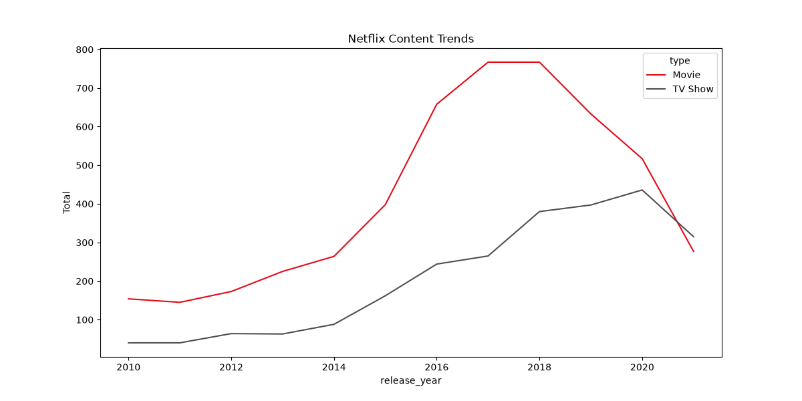
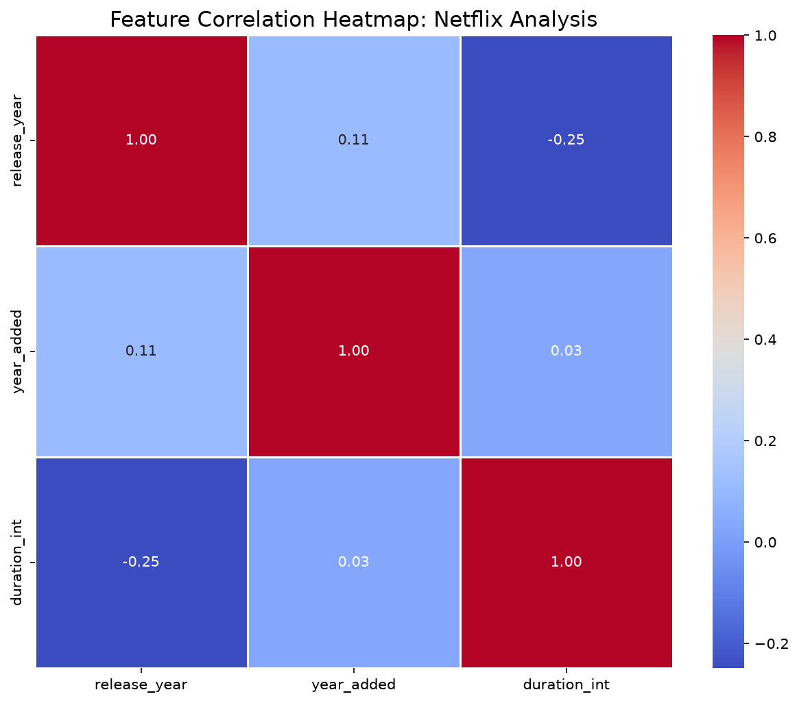

# 🎬 Netflix Content Analysis & Recommendation Trends


## 📌 Project Overview
This project performs an in-depth Exploratory Data Analysis (EDA) on a dataset containing over **8,800 Netflix titles**. The goal is to uncover shifts in Netflix's content strategy, identify top-performing genres, and visualize the global distribution of content.

### 🔍 Key Insights
- **Content Shift:** Analysis shows a massive pivot toward TV Shows over Movies starting around 2015.
- **Global Leader:** The United States remains the top producer, followed closely by India for Movie content.
- **Genre Dominance:** International Movies and Dramas represent the largest share of the library.

---

## 📊 Visualizations

### 1. Strategy Shift (Movies vs TV Shows)
This chart tracks how Netflix has changed its library composition over the last decade.


### 2. Global Content Distribution
An interactive map showing which countries are the biggest contributors to the Netflix library.

### 📈 Exploratory Data Analysis (EDA)
Beyond basic counts, this phase focused on finding hidden relationships:
- **Feature Correlation:** Utilized Heatmaps to identify strong linear relationships between variables (e.g., Sales vs. Profit).
- **Data Distribution:** Analyzed skewness and kurtosis of key metrics to prepare for future predictive modeling.
- **Segment Analysis:** Grouped data by categories to identify high-value clusters.


---

## 🛠️ Installation & Usage

1. **Clone the repo:**
   ```bash
   git clone [https://github.com/jaishdahiya6-del/netflix-content-analysis.git](https://github.com/jaishdahiya6-del/netflix-content-analysis.git)
